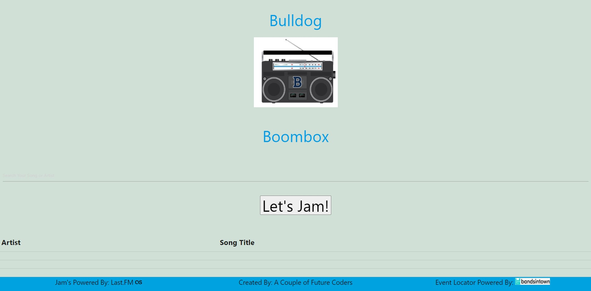

# Bulldog-Boombox

## What is Bulldog Boombox?
Bulldog Boombox is a application for anyone who loves music! If you are sick and tired of YouTube creating a playlist for you that pulls songs from different genres, then we've got the fix for you!

Our dynamically created application pulls data related to songs and artists from 2 distinct server-side API's, Last.FM and Bandsintown.
This data includes:
* Artist
* Title of Song
* Lyrics
* Nearest Show/Concert Dates, Location, and Times

## Credits
* Music Data API: https://www.last.fm/api
* Music Events API: https://www.artists.bandsintown.com/support/api-installation
* CSS Framework: https://materializecss.com/getting-started.html
* CSS Framework for Icons https://fontawesome.com/
* Google Fonts API: https://developers.google.com/fonts

Link to website: https://ktodoran.github.io/Bulldog-Boombox/
Link to Repository: https://github.com/ktodoran/Bulldog-Boombox

This is a landing page for my third created Javascript file, a Daily Task Planner!
If you need to get organized, and plan your day out with all of the tasks you have planned, then this is for you!

There is a screenshot of the layout provided above! Feel free to take a look at its layout!

This file was created by the collaboration of Kyle Todoran, James Crawley, and Verna Heyne!